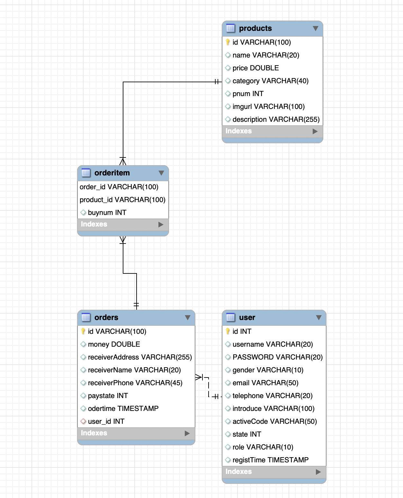

# Javaweb_bookstore
# Introductoin
BOOKSTORE website allows customers buy books from this website, this application can implements the following functions:
  - Customers can register an account in this website.
  - After customers register account, they will recieve an email to active their account.
  - Customers can log in, change their own information, and log out.
  - Administrators can upload products' information.
  - Custerms can add products to shopping car, or delete products from shopping car.
  - Finally, customers can get the finnly bill.
  
# Quik Start
  - JDK "15.0.2"
  - Tomcat version 8.5
  - My SQL8.0.23
  
# MySQL
  - Creating database
  - Creating tables
  - ER diagram

  
# Code explanation
  - dao(data access object). It is a pattern that provides an abstract interface to some type of database or other persistence mechanism.
  - expection. When the code is programing, if there is any threads, it would be throwed by this pakage.
  - model. 
  - service. change the domain name. show the reasons to customers, if anything can't run well, service will show the reasons to the customers.
  - utils. 
    - C3P0. connect with the database.
    - SENDJMAIL. After customers register an account on this website. Customers will recieve an active email.
  - web.
    - filter.
    - servlet. implement doget and dopost.
